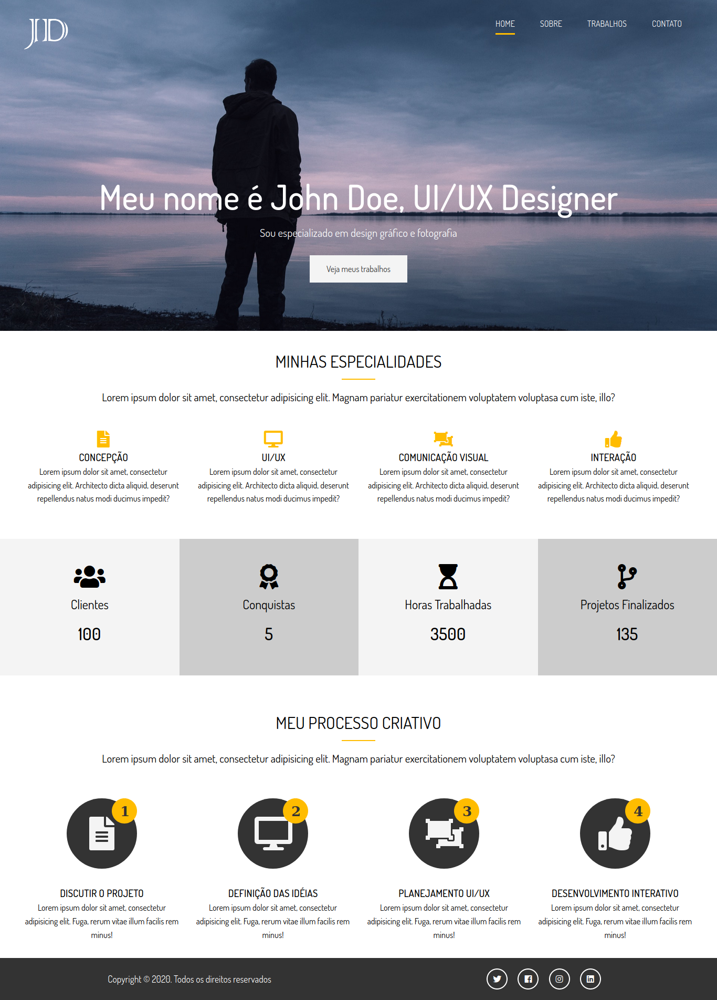

# modern-portfolio-website

## Project

***EN:*** This project is a modern and complete portfolio of a fictional UI / UX Designer that I created for study purposes, focusing on the functionality of SASS through the Modern HTML & CSS From The Beginning course by Brad Traversy.

***PT-BR:*** Este projeto é um portifólio moderno e completo de um UI / UX Designer fictício que eu criei para propósitos de estudo, focando nas funcionalidades do SASS pelo curso Modern HTML & CSS From The Beginning de Brad Traversy.
***

## Technologies

This project was developed with the following technologies:

- HTML
- CSS
- SASS
- JavaScript
***
 
## Preview

***

## License

This project is under the MIT license.
